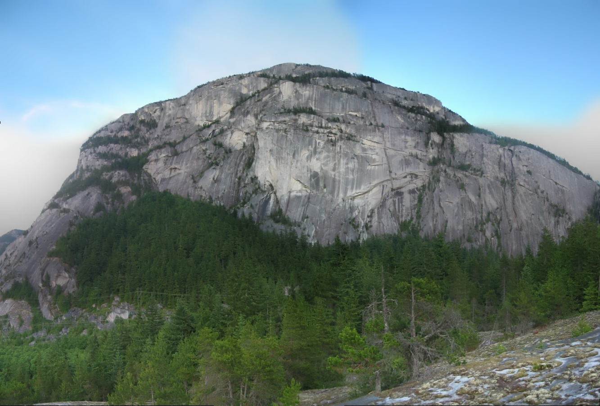

# Image Stitching Demo

这是一个使用Python实现的图像拼接演示程序，基于OpenCV和stitching库(https://github.com/OpenStitching/stitching)。
该程序可以将多张图片拼接成一张全景图。

## 功能特点

- 支持多张图片的自动拼接
- 使用OpenCV和stitching库进行图像处理
- 支持递归搜索目录下的所有图片
- 自动处理图片路径和格式转换

## 环境要求

- Python 3.6+
- OpenCV
- NumPy
- stitching库

## 安装步骤

1. 克隆或下载本项目到本地

2. 安装依赖包：
```bash
pip install -r requirements.txt
```

## 使用方法

1. 准备图片：
   - 将要拼接的图片放在 `samples` 目录下的相应子目录中
   - 支持的图片格式：JPG/JPEG
   - 建议使用有重叠区域的图片以获得更好的拼接效果

2. 运行程序：
```bash
python stitch_demo.py
```

3. 查看结果：
   - 程序会在当前目录生成拼接后的图片
   - 输出文件名为 `mountain_result.jpg`

4. 详细的例子

输入图片：
<div style="display: flex; flex-wrap: wrap; gap: 10px; justify-content: center;">
    <div>
        
        <p style="text-align: center;">待拼接图1</p>
    </div>
    <div>
        
        <p style="text-align: center;">待拼接图2</p>
    </div>
    <div>
        
        <p style="text-align: center;">待拼接图3</p>
    </div>
    <div>
        
        <p style="text-align: center;">待拼接图4</p>
    </div>
    <div>
        
        <p style="text-align: center;">待拼接图5</p>
    </div>
    <div>
        
        <p style="text-align: center;">待拼接图6</p>
    </div>
    <div>
        
        <p style="text-align: center;">待拼接图7</p>
    </div>
</div>

输出结果：
<div style="text-align: center;">
    
    <p>拼接结果</p>
</div>

## 目录结构

```
.
├── README.md
├── requirements.txt
├── stitch_demo.py
├── mountain_result.jpg
└── samples/
    └── mountain/
        └── *.jpg
```

## 注意事项

1. 确保图片质量良好，有足够的重叠区域
2. 图片分辨率不要太高，以免内存不足
3. 建议使用相同相机拍摄的图片进行拼接

## 常见问题

1. 如果遇到内存错误，可以尝试降低图片分辨率
2. 如果拼接效果不理想，可以尝试调整图片顺序或增加重叠区域
3. 确保所有依赖包都已正确安装

## 许可证

MIT License

## 贡献

欢迎提交Issue和Pull Request来帮助改进这个项目。
